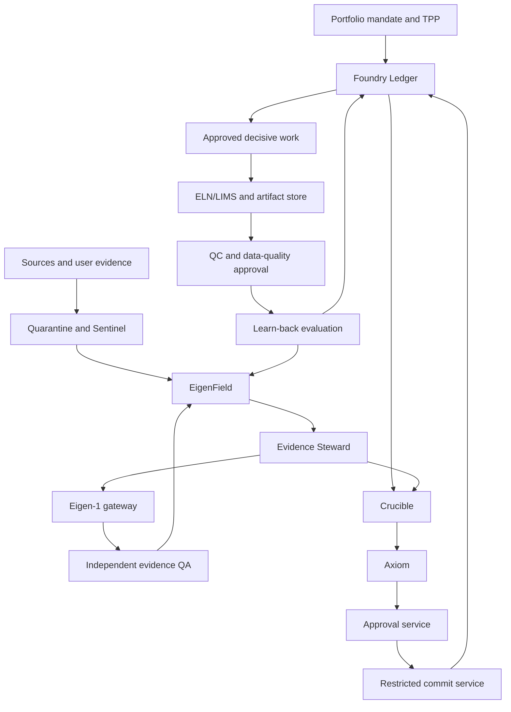

# Eigen Foundry Master Build Plan

**Mandate ID:** `BUILD-EIGEN-FOUNDRY-003`  
**Version:** `1.0-proposed`  
**Status:** `PROPOSED — HUMAN APPROVAL REQUIRED`  
**Supersedes for build sequencing:** `EIGEN_FOUNDRY_EXECUTION_BLUEPRINT_v0.2` after approval  
**Scope:** Forge, Foundry Ledger, Eigen Conclave, EigenField/Eigen-1 integration, decisive work, learn-back, route comparison, and production qualification

## 1. Decision

Build one product through dependency-ordered, end-to-end milestones.

The current repository is a technical foundation. It is not yet a working Foundry or a working live Conclave. Technical activity may be reported as foundation progress only. Product capability is reported only after its observable milestone exit test passes on the protected baseline.

The target product is a supervised operating system that turns evidence into a complete, decision-ready therapeutic program and continuously improves that program as evidence and results change.

Its first credible proof is:

`mock evidence event → bounded F0 Crucible → human approval → atomic commit → approved work order → result/QC → learn-back → successor Crucible`

The first real-program proof follows with one CRC or PRAD pilot using authorized, versioned evidence.

## 2. What each named system does

| System | Product responsibility | Explicit boundary |
|---|---|---|
| **Eigen Foundry** | Owns the complete therapeutic Program lifecycle, decisions, work, and learn-back | Does not alter its own software or bypass human gates |
| **Forge** | Builds, tests, reviews, repairs, and releases Foundry software | Makes no scientific, program, evidence, spend, or transaction decision |
| **Eigen Conclave** | Supplies accountable, challenged analysis for a bounded decision | Does not approve, commit, promote evidence, or change policy |
| **Crucible** | One finite, evidence-frozen Conclave session | New material evidence creates a successor session |
| **Foundry Ledger** | Canonical Program, session, approval, work-order, result/QC metadata and pointers, task, and audit state | Raw result artifacts remain external; chat and model memory are never canonical state |
| **Axiom** | Deterministically evaluates whether an exact packet is admissible | Has no model, retrieval, network, or generic write authority |
| **Sentinel** | Ingests evidence and detects material changes | Does not decide their scientific or portfolio implication |
| **EigenField** | Stores versioned biological and therapeutic evidence with provenance | Is not the workflow ledger or final causal authority |
| **Eigen-1** | Produces context-specific, versioned mechanism and intervention predictions | Predictions remain model evidence until independently validated |
| **Gate Authority** | Humans approve protected actions against exact immutable digests | Cannot bypass server-enforced hard gates |

Current kernel names map to the product architecture as follows:

| Current kernel name | Product name |
|---|---|
| `CouncilService` | Conclave orchestrator/domain command service |
| `CouncilSession` | Crucible |
| policy evaluator / Arbiter | Axiom deterministic policy service |
| Council runtime | Conclave runtime |

Implementation may retain compatibility names temporarily. User-facing and architectural language follows the product names above.

## 3. What “working” means

Five labels are permitted.

| Label | Required proof |
|---|---|
| **Technical foundation** | Repository, tests, schemas, CI, and governance controls are reproducible and reviewed |
| **Synthetic Conclave harness** | Mock seats complete the deterministic F0 session path; this validates orchestration only |
| **Working Conclave** | Live versioned model seats with distinct run identities, structured-output validation, bounded failure handling, and authenticated human approval complete a persistent synthetic F0 Crucible |
| **Working Foundry MVP** | The full synthetic evidence-to-decision-to-work-to-result-to-learn-back loop completes through authenticated staging UX/API across restart and duplicate delivery |
| **Production-qualified Foundry** | Authorized real evidence, identity, security, recovery, operator UX, program pilots, and operational acceptance all pass |

No lower label may be described using a higher label.

### Working Foundry MVP acceptance script

1. Create one stable synthetic Program.
2. Ingest one versioned mock evidence event.
3. Map the event to that Program exactly once.
4. Open one F0 Crucible with one decision charter.
5. Assemble and freeze one evidence manifest.
6. Produce independent blind assessments for all five cases.
7. Reveal claims, challenge them, resolve them, and complete Red Team review.
8. Run Axiom against the exact immutable packet.
9. Collect required human approvals against the packet digest.
10. Re-run Axiom and atomically commit the authorized transition.
11. Create one approved decisive-work order with prediction, alternatives, falsifier, kill criterion, protocol, rights, budget, owner, deadline, and QC standard.
12. Ingest one result and its QC disposition.
13. Compare the result with the frozen prediction and attribute failure where applicable.
14. Preserve positive, negative, null, contradictory, and failed-QC outcomes.
15. Create a successor evidence snapshot and successor Crucible.
16. Replay every trigger and prove no duplicate Program, session, approval, task, work order, result, or decision appears.
17. Force a crash between approval and commit; resume without duplicate state.
18. Display every state, blocker, decision, and next action in the operator UX.

The complete script runs through the authenticated staging UX and command API. Tests may seed authorized mock source events; they may not shortcut the workflow through fixtures, internal service calls, or direct database writes.

### Required adversarial acceptance

- A material `UNKNOWN`, hard `FAIL`, unresolved challenge, or submitted unresolved dissent blocks advancement.
- Changed, stale, or post-freeze material input invalidates prior admissibility and approval.
- Rejection, expiry, wrong functional role, agent approval, and self-approval block commit.
- Failed QC cannot promote evidence, release spend, satisfy a gate, or advance formal state.
- Missing spend approval or missing data/result rights blocks decisive work.
- Two writers produce one valid transition and one safe state conflict.
- Duplicate, delayed, and reordered events create no duplicate or regressed state.
- Retrieved instructions cannot alter permissions, evidence semantics, gates, tools, or approval requirements.
- Every failure is visible in the operator UX with its rule, owner role, recovery path, and immutable evidence.

## 4. User experience to build

The first product is an operator-guided program workspace. A user must always be able to answer: **What changed? What is blocked? What decision is next? Why? Who must act?**

### 4.1 Intake, mandate, and TPP builder

- Create an opportunity or Program from a bounded user submission, approved source event, or portfolio mandate.
- Capture unmet need, patient segment, treatment line, future comparator, intended benefit, modality constraints, biomarker strategy, capital ceiling, ownership requirement, and intended disposition before material discovery.
- Accept user-contributed evidence through quarantine, provenance, confidentiality, rights, entity-resolution, and quality review before it can enter an evidence snapshot.
- Draft the decision charter and route it for scope approval before opening a Crucible.

### 4.2 Portfolio home

- Programs by formal stage, disposition, catalyst, owner, and expiry.
- New material evidence and affected Programs.
- Hard blockers across Scientific, Product, Control, Execution, and Investment cases.
- Pending human approvals, overdue decisive work, and capacity constraints.
- Opportunity queue only after the closed Foundry loop works.

### 4.3 Program workspace

- Stable Program identity and immutable version history.
- Disease context, patient segment, mechanism, intervention direction, modality, asset/product route, biomarker, TPP, rights, validation, development, capital, and intended disposition.
- Five synchronized cases with claim-level evidence, uncertainty, contradictions, falsifiers, and conditions.
- Current formal stage separated from parallel later-stage workstreams.
- Clear next decisive action and why it changes the decision.
- Conditions and blockers with required resolution evidence, owner role, deadline, trigger, and expiry.

### 4.4 Evidence workspace

- Evidence requests, source locators, provenance, rights, context, dependency clusters, uncertainty, and staleness.
- Supportive, contradictory, null, negative, missing, and failed evidence remain visible.
- Eigen-1 predictions visibly labeled as model predictions.
- Frozen snapshots and successor relationships.
- User uploads and connector submissions remain quarantined until provenance, rights, and quality review pass.

### 4.5 Crucible room

- Charter, seats, conflicts, deadlines, frozen inputs, and session state.
- Charter drafting, scope approval, evidence-request status, return, supersession, and expiry.
- Blind assessments before reveal.
- Challenges, responses, independent resolutions, dissent, and Red Team findings.
- Axiom rule trace, blockers, required approvals, and exact packet digest.

### 4.6 Approval and commit queue

- Exact proposed action, immutable packet, changed inputs, role required, conditions, and expiry.
- Human approve/reject controls with identity and MFA-aware evidence.
- Commit result, state conflict, replay, or expiry outcome.

### 4.7 Work, result, and learn-back workspace

- Approved work orders with budget, rights, protocol, owner, deadline, prediction, falsifier, kill criterion, and QC requirements.
- Raw-result pointers, QC, analysis lineage, prediction comparison, and failure attribution.
- Decision consequence and successor session.

### 4.8 Route comparison and transferable package

- Compare existing asset, repositioning, rescue, combination, known-target/new-candidate, and de novo routes against one frozen TPP.
- Show modality, exposure, therapeutic window, IP/FTO, control, CMC, regulatory, clinical, commercial, capital, and partnerability differences without averaging away hard failures.
- Generate a third-party-readable Program dossier, evidence index, TPP, risk register, validation plan, rights package, development plan, capital plan, and data-room export.

### 4.9 System health and recovery

- Connector authorization, last successful sync, staleness, failed joins, quarantined items, replay status, and affected Programs.
- Ledger, outbox, model gateway, EigenField, artifact store, and ELN/LIMS health.
- Failed command, crash checkpoint, rollback, restore, and operator-approved recovery actions.

## 5. Product decision logic

Foundry begins with a product and portfolio decision, not an unbounded target search.

1. **Set the portfolio mandate.** Define indication boundaries, ownership requirements, capital constraints, capacity, intended disposition, and unacceptable risks.
2. **Frame TPP v0.** Define unmet need, patient segment, treatment line, launch-year comparator, meaningful benefit, endpoint, regimen, safety ceiling, biomarker constraints, development time, and maximum capital to decisive proof.
3. **Form the causal question.** Specify tissue, cell compartment, subtype, genotype, treatment history, resistance state, desired state transition, assumptions, alternatives, and falsifiers.
4. **Generate and ground hypotheses.** Eigen-1 proposes context-specific mechanisms and intervention directions. EigenField grounds them in versioned supportive, contradictory, null, negative, and missing evidence.
5. **Qualify the intervention.** Assess causality, direction, necessity, sufficiency, reversibility, context, escape, target engagement, phenotype, human relevance, normal-tissue counterfactual, and therapeutic window.
6. **Compare executable routes on one product bar.** Evaluate existing assets, repositioning, rescue, combination, known-target/new-candidate, and novel-target/de novo routes across modality, exposure, control, IP/FTO, CMC, regulatory path, differentiation, time, capital, and partnerability.
7. **Fund the next decisive decision.** Choose the smallest approved analysis, diligence action, or experiment with the highest decision-changing information per unit of cash, time, and constrained capacity.
8. **Nominate only a transferable Program.** Require a coherent product/candidate package, biomarker, validation, control, development, capital, risk, data-room, and intended-disposition package that a third party can diligence and continue.
9. **Learn back.** Preserve frozen predictions, results, QC, nulls, contradictions, failure attribution, and decision consequences; create successor evidence and sessions without overwriting history.

Every Program is represented as:

`disease context × patient segment × causal mechanism × intervention direction × product/asset × modality × biomarker × TPP × rights strategy × validation plan × development route × capital plan × intended disposition`

## 6. System topology

The Ledger persists mandate, Program, session, approval, decision, work-order, and audit state throughout the flow. Humans sign through the Approval Service. Only the Restricted Commit Service writes an authorized formal transition.

Raw results remain in ELN/LIMS or the artifact store. QC and data-quality/evidence-promotion approval occur before a qualifying result becomes a new EigenField evidence version. Learn-back also records its decision consequence in the Ledger.

Independent QA admission of an Eigen-1 output preserves the `MODEL_PREDICTION` label, model/run provenance, calibration, uncertainty, and context of use. Admission never upgrades it to experimental or translational validation.

Forge is a separate software-delivery loop. A Conclave capability gap becomes authorized Forge work and returns only as a qualified, pinned release.

## 7. Persistent loops

The governed build loop is:

`approved scope → bounded implementation → deterministic validation → staging deployment → end-to-end acceptance → independent adversarial review → bounded repair → clean rerun → protected merge/release → milestone approval`

A failed or changed revision returns to validation. A blocker, exhausted repair budget, authority boundary, security event, or scope change stops the loop with durable evidence.

| Loop | Trigger | Terminal output |
|---|---|---|
| **Forge build/repair** | Authorized capability or defect | Reviewed, qualified software release or typed blocker |
| **Evidence ingestion** | New public/private source version | Quarantined, normalized, rights-aware evidence version |
| **Material change** | Accepted evidence or policy delta | Watch event, new opportunity, or successor Crucible |
| **Crucible** | One bounded decision charter | Human-authorized disposition or blocked packet |
| **Decisive work** | Material unknown | Smallest approved decision-changing action and result |
| **Learn-back** | Accepted result/QC | Failure attribution, successor evidence, successor Crucible |
| **Portfolio** | Capacity, capital, risk, catalyst, or expiry event | Fund, defer, partner, externalize, redesign, or terminate proposal |

## 8. Product milestone graph

Milestones are cumulative. A later milestone can be prototyped; it cannot be declared complete before its hard dependencies pass.

| Milestone | Build scope | Observable exit test | Current state |
|---|---|---|---|
| **M0 — Approved mandate** | This master plan, authority boundaries, labels, dependencies, and acceptance suite | Required human roles approve the exact digest; independent review records no blocking ambiguity; checkpoint migration is merged | **IN PROGRESS** |
| **M1 — Trustworthy foundation** | Repository baseline, semantic repairs, Forge Lite, crash recovery, protection, and secret controls | Clean protected baseline; four audited defects fail closed; one work item reaches independent review without another prompt; crash resumes safely | **PARTIAL** |
| **M2 — Persistent Foundry core** | Postgres Ledger/API, OIDC/service identity, authorization, outbox, artifact pointers, operator UX shell | Restart/two-writer/idempotency tests pass; only restricted commit path changes formal state; operator sees durable state | **NOT STARTED** |
| **M3 — Synthetic Conclave harness** | Axiom-first mock seats, frozen context, challenge, Red Team, approval and commit contracts | Mock F0 Crucible passes deterministic and adversarial tests; it is reported only as a harness | **COMPLETED** (PR #34; 6/6 criteria VERIFIED) |
| **M4 — Working Conclave** | Live versioned model seats, distinct run identities, tool envelopes, structured outputs, failure handling, authenticated human approval/commit UI | Live seats reproduce the synthetic F0 flow without new authority; exact authenticated approvals gate atomic commit | **IN PROGRESS** (PRs #35–37; orchestration+seat+approval console verified; live-model binding M4-C1/C4 partial) |
| **M5 — Working Foundry MVP** | Synthetic Sentinel event, work orders, results/QC, failure attribution, learn-back, successor sessions, operator recovery | The 18-step closed-loop and adversarial acceptance suites pass through staging UX/API across crash and replay | **NOT STARTED** |
| **M6 — Eigen-grounded F0–F2** | Read-only EigenField Steward, versioned Eigen-1 gateway, F0–F2 policies, CRC/PRAD program workspace | One authorized CRC or PRAD dry run produces traceable packets; model output never satisfies experimental gates | **NOT STARTED** |
| **M7 — Preclinical complete-program lifecycle** | F3 model/assay readiness, F4 mechanism/target qualification, F5 route/control/modality, F6A/B/C route qualification, F7 optimization/translation, F8 nomination, and portfolio controls | Existing-asset/rescue and de novo routes each complete governed F0–F8 dry runs against one frozen TPP; no gate skips; a nominated transferable package is third-party readable | **NOT STARTED** |
| **M8 — Development lifecycle support** | F9 IND-enabling/regulatory readiness, F10 human proof of mechanism/dose, F11 clinical proof of concept, and F12 registration/externalization/lifecycle/termination workflows | Each F9–F12 policy, artifact contract, approval path, integration boundary, and failure route passes a synthetic or approved retrospective dry run; no dry run is reported as real therapeutic advancement | **NOT STARTED** |
| **M9 — Production qualification** | Security, backup/restore, observability, connector recovery, operational controls, soak, and release recovery across enabled stages | CRC and PRAD current-gate packages regenerate; route dry runs pass; transferable package passes review; security/restore/rollback pass; no enabled gate has undefined policy; exact deployed release and rollback evidence are recorded | **NOT STARTED** |

### Milestone and checkpoint mapping

The repository currently uses legacy engineering checkpoints `P0`–`P7`. Product milestones `M0`–`M9` become authoritative only after a reviewed checkpoint migration.

| Product milestone | Current engineering checkpoint | Activation change |
|---|---|---|
| M0 | none | Add mandate-approval checkpoint bound to plan digest and review record |
| M1 | P0 Secure baseline + P1 Repair kernel + P2 Forge Lite | Preserve; add B2 crash/recovery criteria to P2 or a successor checkpoint |
| M2 | P3 Foundry Ledger and API | Preserve and add authenticated operator-UX exit evidence |
| M3 | part of P4 Conclave v1 | Split a non-product mock-harness checkpoint from P4 |
| M4 | P4 Conclave v1 | Reserve completion for live seats plus authenticated approval/commit |
| M5 | P6 Closed Foundry loop | Preserve capability; move before real-program product claims in the dependency graph |
| M6 | P5 Eigen integration | Preserve capability; require authorized CRC or PRAD F0–F2 dry-run evidence |
| M7 | part of P7 Production expansion | Add explicit F3–F8 policy and dry-run checkpoints |
| M8 | none | Add F9–F12 software-lifecycle support checkpoints; real Program advancement remains separately human-gated |
| M9 | P7 Production expansion | Reserve completion for the normative production acceptance suite across every enabled stage |

Legacy blueprint labels map as follows: `B0` is the repository baseline; `B0.5` is kernel semantic stabilization; `B1` is Forge Lite; `B2` is Forge crash recovery and protection; `F1`–`F10` are implementation increments consumed by M2–M9.

Activation requires a dedicated successor work item to update `forge/state/checkpoints.json` and its schema. Until that merge, `P0`–`P7` remain canonical engineering state and all product milestone labels remain proposed reporting overlays.

## 9. Current engineering mapped honestly

As of 2026-08-14, the repository work is inside **M1 — Trustworthy foundation**.

No criterion in the canonical `P0`–`P7` checkpoint record is `VERIFIED`; no engineering phase or product milestone is complete.

| Work | Product meaning | Status |
|---|---|---|
| PR #12 — fail closed on material `UNKNOWN` | Repairs one kernel safety invariant | Validated; independent review and merge pending |
| PR #13 — replayable policy artifacts | Makes historical policy evaluation reconstructable | Validated; independent review and merge pending |
| PR #14 — committed Forge schema enforcement | Makes build records machine-verifiable | Validated; independent review and merge pending |
| PR #15 — reproducible offline build | Hardens software supply and build determinism | Validated; independent review and merge pending |
| PR #16 — reachable-history secret scan | Adds repository-history security evidence | Validated; stacked review and merge pending |
| Issue #6 — F0 route invariant | Completes an audited kernel correctness repair | Ready; unimplemented |
| Issue #7 — immutable dissent | Completes an audited kernel correctness repair | Ready; unimplemented |
| Issue #17 — master build plan | Establishes the proposed product mandate and milestone graph | Claimed; independent review and approval pending |
| Credential rotation and branch protection | Human security/control requirements | Human action pending |

These items are necessary foundation work. None proves a working Conclave or Foundry.

## 10. Ordered implementation backlog

1. Approve or amend this exact master-plan revision.
2. Migrate the checkpoint schema and `forge/state/checkpoints.json` to the approved M0–M9 graph; bind the migration to the plan digest.
3. Independently review and integrate PRs #12–#16 in dependency-safe order; rerun exact combined-head CI.
4. Complete F0 route and immutable-dissent repairs with deterministic regressions.
5. Prove Forge recovery: forced crash, lease expiry, checkpoint resume, replay protection, protected-path refusal, and kill switch.
6. Build the production Foundry Ledger/API and identity boundary.
7. Build the operator UX shell against durable Ledger state.
8. Build Axiom-first mock Conclave seats and the complete synthetic F0 Crucible.
9. Add live seat runtime without increasing agent authority.
10. Complete the synthetic staging loop with approved work, result/QC, failure attribution, learn-back, successor sessions, crash recovery, and replay.
11. Add the read-only EigenField Evidence Steward and immutable snapshots.
12. Add the versioned Eigen-1 analysis gateway and prediction controls.
13. Implement F0–F2 policies and run one authorized CRC or PRAD dry run.
14. Add approved Sentinel public/private connectors and material-change routing.
15. Add complete F3–F8 model, mechanism, route, modality, asset, rights, execution, investment, nomination, and portfolio policies/workspaces.
16. Add F9–F12 development, regulatory, clinical, registration, externalization, lifecycle, and termination workflows without implying real gate completion.
17. Qualify the production release through security, restore, soak, operational acceptance, and current-gate regeneration.

## 11. Build and reporting discipline

- One approved milestone graph governs all implementation.
- One bounded work item changes one objective.
- Every work item names dependencies, allowed paths, acceptance commands, stop rules, and rollback scope.
- Code does not begin when the product or governance decision is ambiguous.
- Safety-critical foundation repairs may continue while unrelated human approvals are pending.
- Validation, review, approval, and release bind exact immutable revisions.
- Changed revisions invalidate prior evidence.
- No author reviews or merges its own work.
- Local output and chat narration are supporting context only.
- Status reports lead with the highest product milestone actually passed.

## 12. Human authority retained

Human approval remains required for:

- This build mandate and material architecture changes.
- Gate, evidence, scoring, model, or route semantics.
- Credentials, permissions, protected repository rules, and production deployment.
- Program mandates, TPPs, stages, routes, holds, redesigns, termination, and portfolio allocation.
- Evidence promotion, experiments, spend, external outreach, contracts, transactions, and regulated actions.

### M0 approval record

The proposed functional approver roles are:

- Build Mandate Owner — assignment `TBD`.
- Engineering Authority — assignment `TBD`.
- Foundry Governance/Safety Authority — assignment `TBD`.

The independent reviewer must be distinct from the authoring run. Each approval binds the exact document SHA-256, repository head SHA, review record, conditions, and expiry. Until the production Ledger exists, the protected GitHub issue, pull request, and merged commit are the durable approval record.

The three functional approval roles may be held by the same authorized human during the controlled build, with separate recorded sign-offs. Independent review remains a distinct actor/run.

Approval of this plan does not approve a therapeutic Program, architecture implementation change beyond its reviewed work items, production deployment, credentials, spend, evidence promotion, or transaction.

## 13. Planning range

Existing planning documents contain two different scopes:

- **6–9 focused weeks** estimates productionizing the governance kernel through Ledger, agent runtime, evidence adapter, learn-back, and route functions.
- **8–13 elapsed weeks** estimates the first genuinely closed Foundry loop including Forge/recovery foundations and integration dependencies.

Both ranges assume:

- one backend/control-plane engineer;
- one agent/runtime engineer;
- part-time evidence engineering;
- timely access and human decisions; and
- no material interface redesign.

These are planning ranges, not committed schedules. The master milestone graph governs scope; owners, interfaces, and availability must be confirmed before dates are assigned.

The ranges above stop at the first closed loop. Full F3–F12 software support and real therapeutic progression depend on program evidence, experiments, regulatory work, clinical execution, integrations, and separately approved capital; their schedule remains `TBD`.

## 14. Immediate stopping condition

No new feature implementation should outrun this mandate.

The next build stage begins after:

1. Human approval or amendment of this plan.
2. Independent review of its internal consistency and executable acceptance criteria.
3. Recording the approved revision as the active Build Mandate.

Foundation security work already in review may proceed. Product milestone claims remain frozen at **M1 — PARTIAL**.
