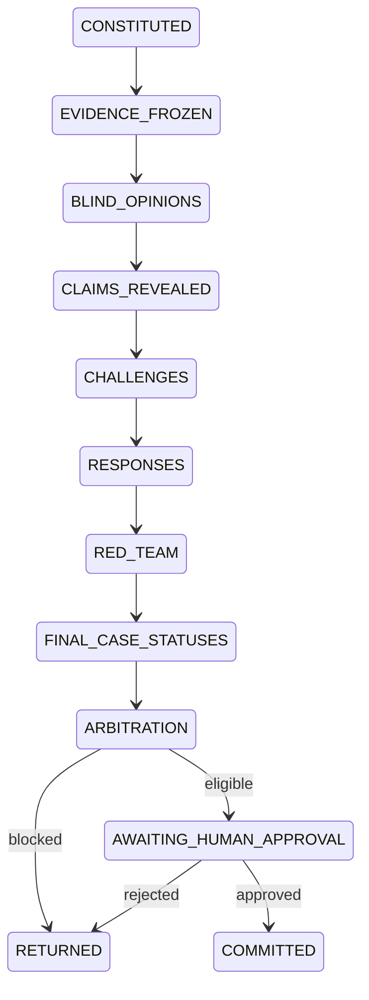

# Eigen Foundry Council

Executable governance core for bounded, auditable Drug Foundry council sessions.

**Classification:** `MANDATE`  
**Version:** `FOUNDRY-COUNCIL-v0.1`  
**Status:** `NONCANONICAL DRAFT`

This repository implements the first controlled slice. It does not make therapeutic decisions, call models, write to EigenField, spend money, contact counterparties, or represent a deployed Foundry Ledger.

## What works now

- Immutable Pydantic contracts for Programs, council sessions, claims, challenges, five cases, red-team reports, gate packets, approvals, and audit events.
- Formal `F0`–`F12` stage graph. Skipped gates are rejected; only the F0 acceptance policy is enabled in v0.1.
- Finite council state machine from constitution through human-approved commit.
- One blind opinion per case captain. Submission returns only a receipt until reveal.
- One bounded challenge/response/resolution round.
- Deterministic hard-gate evaluation. No voting or averaged scores.
- Kernel-enforced separation of Commander, Evidence Steward, Program Architect, Case Captains, Red Team, independent reviewer, policy service, humans, and commit service after a trusted identity envelope is supplied.
- Content-addressed Program, evidence, TPP, rights, budget, risk, standard-of-care, and policy bindings.
- SQLite MVP ledger with immutable aggregate versions, optimistic concurrency, duplicate-write protection, immutable approvals/decisions, atomic Program/session commit, and hash-chained events.
- Exact functional human sign-offs for F0; undefined or disabled gate policies fail closed.
- Automated tests covering F0 commit, evidence freeze, blind reads, hard failures, dissent, packet binding, policy freshness, self-approval, expiry, idempotency-key misuse, gate skipping, concurrency, terminal state, and immutability.

## Runtime flow



Every material input is versioned and hashed. Off-manifest evidence is rejected. An operator must create a successor session to admit new evidence.

## Quick start

Python 3.12 and Pydantic 2 are required.

```bash
make bootstrap
make check
PYTHONPATH=src python3 -m foundry_council init-db --db ./foundry.sqlite3
```

Install as an editable package when packaging tools are available:

```bash
python3 -m pip install -e .
foundry-council init-db --db ./foundry.sqlite3
```

## Project map

```text
src/foundry_council/
  models.py       canonical contracts and enums
  agents.py       council seats, permissions, independence rules
  policy.py       stage graph, hard gates, approver policy, packet hashing
  ledger.py       transactional SQLite ledger and immutable audit trail
  service.py      sole governed command path
  cli.py          local ledger inspection utility
schemas/
  foundry-council.schema.json
tests/
  helpers.py      deterministic mock council fixtures
  test_council.py governance, concurrency, and end-to-end tests
docs/
  architecture.md
  api-contract.md
  forge-lite.md
  implementation-plan.md
forge/
  contracts/        machine-readable checkpoint and work-item schemas
  state/            evidence-backed M0–M9 milestone checkpoint state
  work-items/       bounded software work-item records
.github/
  workflows/ci.yml  secret, contract, test, schema, and package checks
```

`BUILD_SPEC.md`, `AGENTS.md`, and `PLANS.md` define the resumable GitHub-native Forge loop. Passing local checks is supporting evidence only; a milestone gate requires criterion-bound commit, CI, review, and approval evidence in `forge/state/checkpoints.json`. M0–M9 software state never advances a therapeutic Program F0–F12 stage.

## Authority boundary

Agents may draft, cite, challenge, respond, and recommend. Deterministic policy evaluates eligibility. Human sign-offs bind exact packets. Only the internal commit service changes formal Program state.

`CommandContext` is a trusted internal envelope, not authentication. Do not expose the Python service directly. The production API must derive identity and roles from OIDC/MFA and keep the Ledger private.

## Intentionally unfinished

- HTTP API, OIDC/MFA, program-scoped authorization, approval UI, and outbox workers.
- Production Postgres/event store and artifact retention.
- Real model execution, prompt registry, tool sandbox, and run reproducibility.
- EigenField retrieval and external verification that manifest references exist and are authorized.
- ELN/LIMS results, decisive-work orders, QC, and learn-back.
- Rights, CRM, IP/FTO, clinical-trial, commercial, and competitive adapters.
- F1–F12 stage-specific artifact and acceptance policies. They are disabled, even where approver-role templates exist.
- End-to-end original-response replay for every non-commit command. Repeats currently fail safely without duplicating state.
- Condition-satisfaction and governed exception workflows; conditioned approvals are rejected in this MVP.
- Opportunity Radar. It comes after one full controlled Program loop works.

See [architecture.md](docs/architecture.md) and [implementation-plan.md](docs/implementation-plan.md) for the production build.
