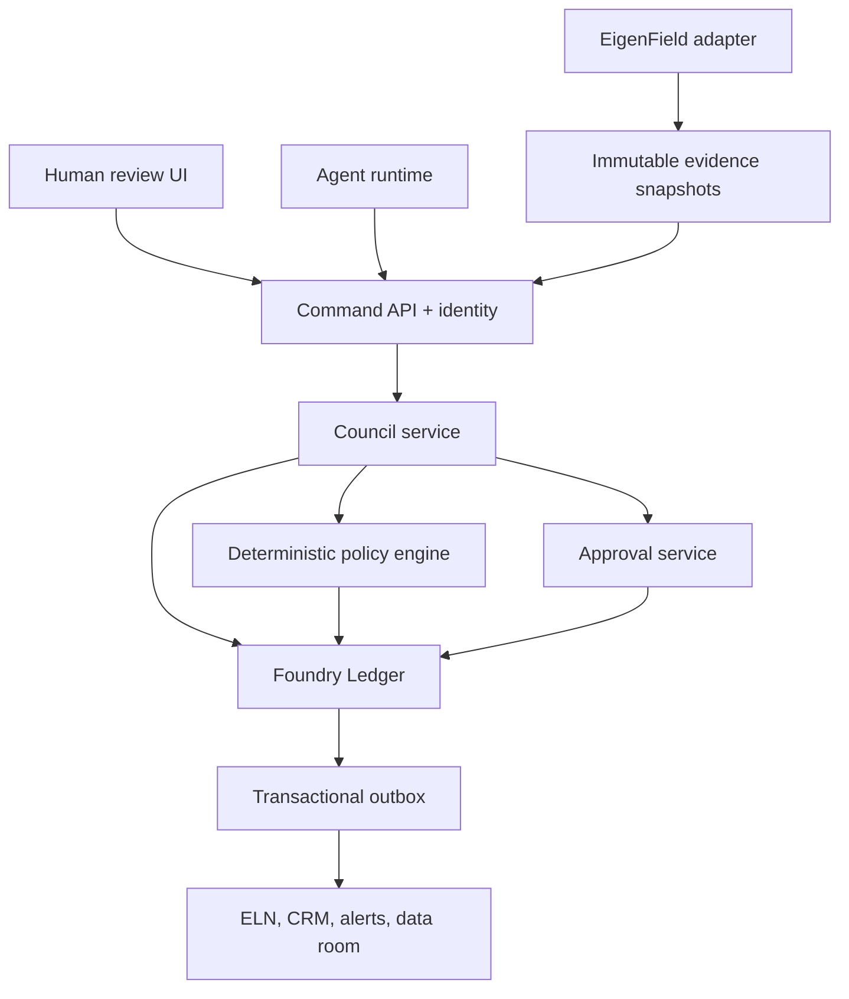

# Council runtime architecture

**Status:** noncanonical implementation draft.

## Control topology

The repository currently implements `Council service`, `Policy engine`, and a single-node SQLite form of the `Foundry Ledger`. The F0 policy is enabled. The other nodes and F1–F12 acceptance definitions are not deployed.

## One source of authority per concern

| Concern | Authority |
|---|---|
| Program stage, decisions, approvals, tasks, budgets, rights pointers, and audit | Foundry Ledger |
| Biological and therapeutic evidence | EigenField evidence versions |
| Raw analyses, reports, patents, contracts, and data-room files | Artifact store |
| Samples, batches, protocols, QC, raw experimental results | ELN/LIMS |
| Counterparties, interactions, obligations, and deal status | CRM/deal system |

Council conversation is deliberative evidence. It is never canonical biological evidence merely because agents repeat or agree with it.

## Aggregate boundaries

### Program

The Program stores stable identity, effective formal stage, status, entry point, route, owner, current immutable pointers, falsifiers, kill criteria, active workstreams, and last decision. It does not copy full evidence or artifacts.

### CouncilSession

A session owns one question and one proposed action. It binds:

- exact Program state version and digest;
- evidence snapshot;
- TPP, rights, budget, risk-register, standard-of-care, and gate-policy versions;
- assigned seats, runs, model versions, prompt versions, independence groups, and conflicts;
- blind opinions and atomic claims;
- challenges, responses, and independent resolutions;
- red-team findings and five final case determinations;
- deterministic rule trace, sealed gate packet, and approval request.

Changing a material binding creates a successor session. Sessions never rewind.

### Gate packet

The packet is content-addressed. Approvals bind its digest, scope, expiry, and required roles. Commit rechecks the Program version, stage, packet digest, hard gates, human sign-offs, and approval conditions in one transaction.

## Separation of duties

| Seat | Can | Cannot |
|---|---|---|
| Commander | Frame and advance procedure | Vote, approve, or commit |
| Evidence Steward | Bind frozen evidence | Recommend disposition or promote evidence |
| Program Architect | Present the integrated thesis | Review or arbitrate itself |
| Case Captain | Own one case | Override another case or approve |
| Independent reviewer | Resolve a challenge | Review its own claim or challenge |
| Red Team | Attack the surviving case | Modify evidence, approve, or commit |
| Policy service | Apply versioned rules | Create evidence or change case status |
| Human approver | Sign within an assigned functional role | Bypass server-enforced gates |
| Commit service | Atomically apply an authorized decision | Exercise scientific judgment |

One person may hold several human functional roles in the controlled build, but each sign-off remains separate. Council seats themselves require distinct actor, run, and independence identities.

## Deterministic conclusion rules

For `ADVANCE`:

1. Exactly one final determination must exist for each case.
2. A hard `FAIL` blocks.
3. A material `UNKNOWN` blocks.
4. Unresolved material disagreement blocks.
5. `CONDITIONAL` blocks unless the exact versioned policy explicitly permits it.
6. `NOT_APPLICABLE` requires an exact gate-rule citation.
7. The red-team report and all challenge resolutions must exist.
8. The proposed stage must be the legal next stage.
9. The session and approvals must be unexpired.

The Arbiter returns eligibility, blocked rules, and a trace. An explanatory model may summarize that trace; it cannot change it.

## Concurrency and replay

- Every aggregate carries an integer state version.
- Commands require the expected version.
- Competing updates produce `STATE_CONFLICT`.
- Idempotency keys prevent duplicate events and commits.
- Exact commit replay returns the committed result. Other repeated commands currently fail safely after their phase transition; the HTTP adapter must add original-response replay.
- The Program update and terminal session event commit atomically.
- Program/session versions, approvals, decisions, and audit events are protected by database triggers.
- Each aggregate event chain includes the prior event hash.

## Trust boundary for model execution

The model adapter will receive structured, immutable references and seat-specific capabilities. Retrieved papers, webpages, patents, emails, contracts, and connector output remain untrusted data. Their embedded instructions never become control-plane commands.

Agents will not receive approval, commit, generic database, unrestricted network, secret-management, or raw SQL tools.

The current `CommandContext` assumes a trusted caller. OIDC/MFA and program-scoped authorization must wrap it before any network deployment.

## Production data path

1. A source system creates a versioned evidence or opportunity event.
2. The Ledger stores an opaque trigger with `eigen-foundry:<program_id>`.
3. The Commander retrieves the authorized Program snapshot.
4. The Evidence Steward creates an immutable manifest.
5. The bounded council produces claims, challenges, final cases, and a packet.
6. The policy service evaluates the exact packet.
7. Humans review and sign the same digest.
8. The commit service revalidates and atomically changes state.
9. The outbox dispatches tasks, notifications, or approved integrations.
